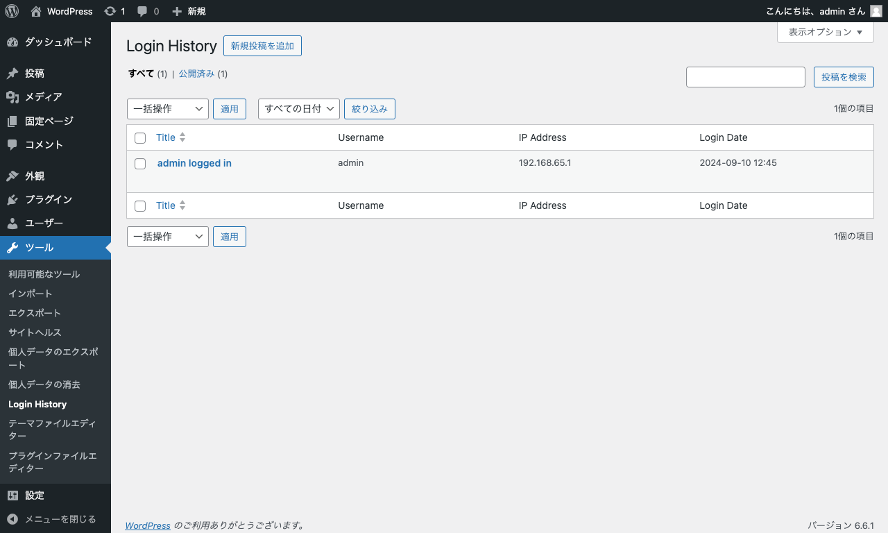

# WordPress プラグイン `custom-login-history`

WordPress でユーザーのログイン履歴をカスタム投稿タイプとして保存するサンプルです。

## 使い方

リポジトリのファイルをダウンロードして WordPress の `wp-content/plugins` ディレクトリに展開してください。

プラグインを有効化した後にユーザーが管理画面にログインすると自動的にログイン履歴のレコード（投稿タイプ）が生成されます。

## 関連ページ

- [WordPress でログイン履歴機能を提供するプラグインまとめ - 実践 WordPress](https://wordpress.dyno.design/login-history/)
